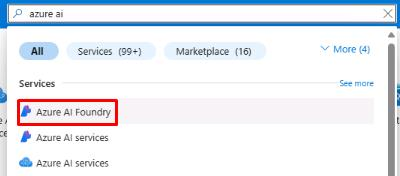
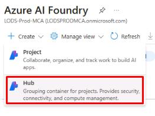
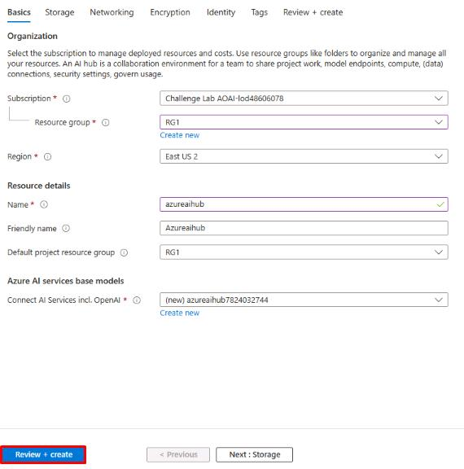
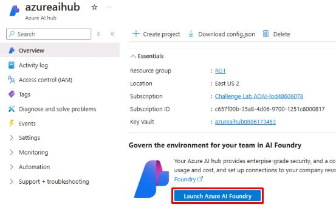
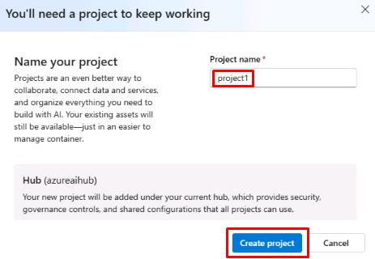
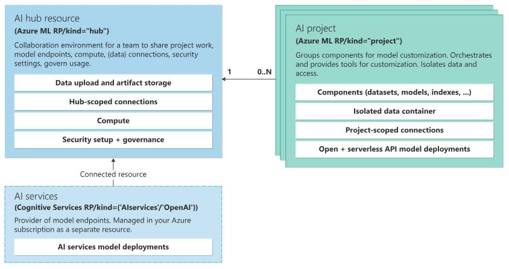

## Task 1 - Set up a hub and project in Azure AI Foundry 

1. Open the Microsoft Edge browser, go to the [Azure Portal site](https://portal.azure.com), and sign in with your credentials. 

1. Once signed in to the portal, select the search bar at the top. Search for **Azure AI** and then select **Azure AI Foundry**.

    

1. From **Azure AI Foundry**, select **+ Create** and then select **Hub**.

    

1. On the **Azure AI hub** page, select your resource group and region (these may differ from the screenshot). Name the hub **azureaihub** and leave the default setting to create a new AI service model. 

1. Select **Review + create**, then select **Create**.

    

1. Once the deployment is complete, select **Go to resource**.

1. From the **azureaihub** page, select **Launch Azure AI Foundry**.

    

1. Azure AI Foundry will open in a new tab. You’ll see a pop-up window to create a new project. Enter **project1** and select **Create project**.

    

    {: .important } 
    > The hub is the overarching development environment. Access to the hub allows you to modify the infrastructure, create new hubs, and create projects. Projects exist within a hub and can have different permissions and resources. When granted access to a project, the user is also automatically granted **Reader** level access to the associated hub. The user is also granted the **Inference Deployment Operator** role, which allows them to create deployments on the resource group that the project is in.
    
    

1. You’ve successfully completed this task. Select **Next** to continue. 