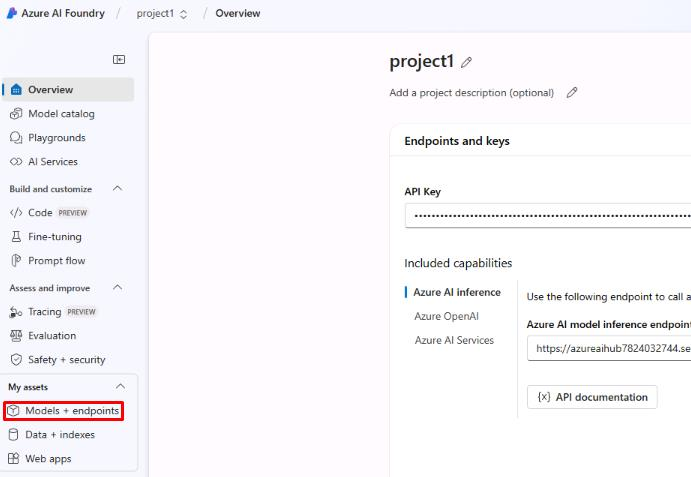
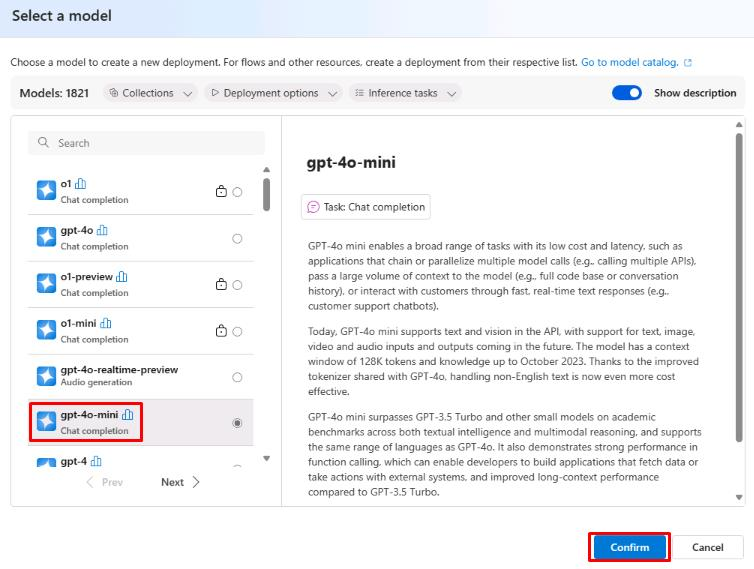
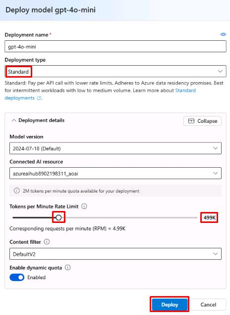
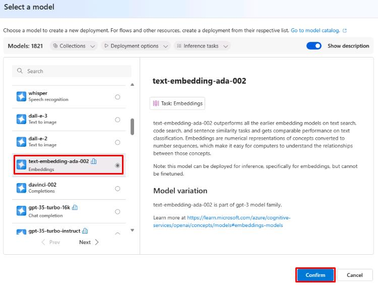

# Task 02: Create AI model deployments

## Introduction

(Placeholder for case study information for task.)

## Description

In this task, you'll deploy the **gpt-4o-mini** and **text-embedding-ada-002** models to your project. These models are necessary for creating an AI-assisted chat application.

## Success Criteria

- The **gpt-4o-mini** model has been deployed.
- The **text-embedding-ada-002** model has been deployed.

## Learning Resources

- [Deploy Models](https://learn.microsoft.com/en-us/azure/ai-studio/tutorials/copilot-sdk-create-resources?tabs=windows#create-helper-script)

## Key tasks

### 01: Deploy gpt-40-mini and text-embedding-ada-002 models

<strong>Expand this section to view the solution</strong>

1. From the **Overview** tab on the **project1** page, select **Models + endpoints** from the left menu.

    

1. From the **Manage deployments of your models and services** page, select **+ Deploy model** and then select **Deploy base model**.

1. From the **Select a model** page, select **gpt-4o-mini**, then select **Confirm**.

    

1. On the **Deploy model gpt-40-mini** page, set the **Deployment type** to **Standard**.

1. Move the **Tokens per Minute Rate Limit** slider to around **500K**. Leave all other settings as default and select **Deploy**.

    

1. Once deployed, select the back button to return to the **Manage deployments of your models and services** page and deploy another base model.

1. For this one, select **text-embedding-ada-002**, then  select **Confirm**.

    

1. Ensure the **Deployment type** is set to **Standard**, then select **Deploy**.

    {: .important } 
    > These models will be used later to create a chatbot for querying product data.

You’ve successfully completed this task.
