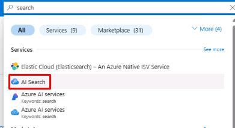
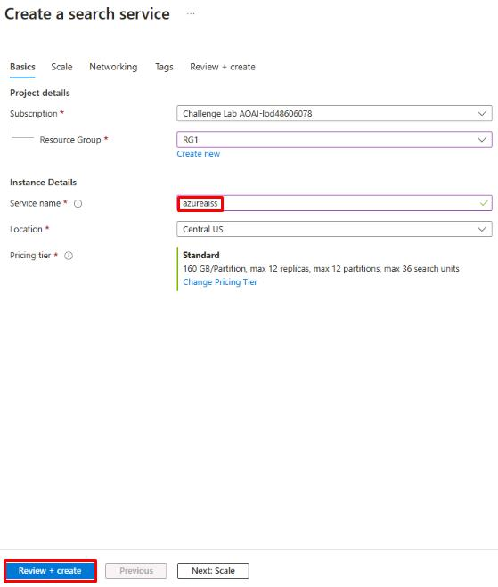
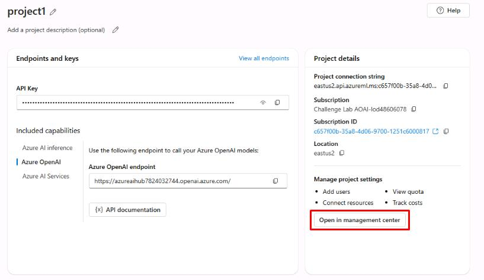
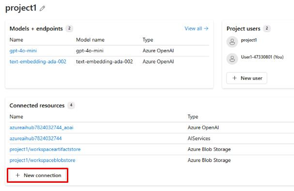
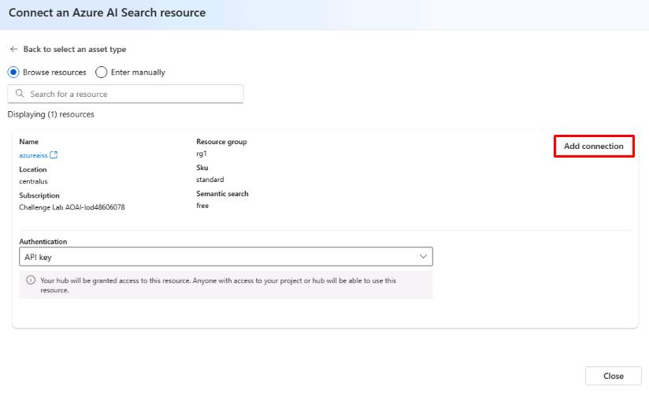

## Task 03: Create a search service and add data connections

## Introduction

(case study information pertinent to this task)

## Description

In this task, you'll …

## Success Criteria

(what should be accomplished when the task is finished)

## Tips (optional)

## Learning Resource (optional)

(list of resources)

## Key tasks

### 01: Create a search service

<strong>Expand this section to view the solution</strong>

1. To create a search service, return to the Azure portal tab.

1. In the search bar at the top, search for **search** , then select **AI Search**.

    

1. From the **AI Search** page, select **Create search service**.

1. On the **Create a search service** page, select your resource group and region (these may differ from the screenshot). Name the search service **azureaiss**, select **Review + create**, then select **Create**.

    

1. Return to the tab with Azure AI Overview . On the right of the Overview  page, select **Open in management center**.

    

1. From the **Management center**  for **project1**, under **Connected resources**, select **+ New connection**.

    

1. On the **Add a connection to external assets** page, select **Azure AI Search**, then select **Add connection** next to the **azureaiss** service.

    

1. You’ve successfully completed this task and exercise.
