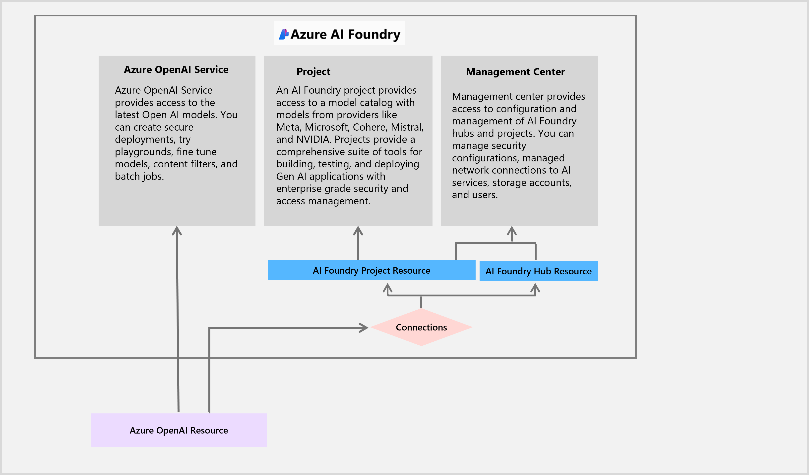

# Exercise 01: Set up Azure AI Foundry

## Scenario

Adatum aims to enhance its user experience with a chatbot, ensuring a safer and more engaging environment for customers. Building a chatbot begins with enabling an AI Foundry, creating a hub, and managing permissions. This foundational step ensures that Adatum has the infrastructure in place to integrate AI-driven customer engagement and content moderation solutions efficiently.

## Objectives

After you complete this exercise, you'll be able to:
- Set up an Azure AI Foundry hub to manage AI projects and services.
- Deploy AI models essential for chat-based applications.
- Create a search service to enhance chatbot capabilities.

{: .important }
This lab requires a MCAPS subscription.

## Exercise one architecture

## Duration

**Estimated time:** 20 minutes
