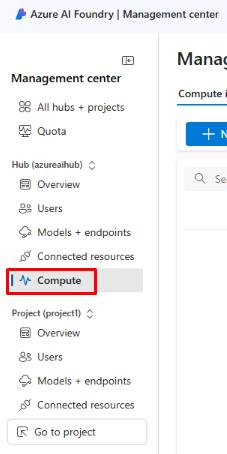
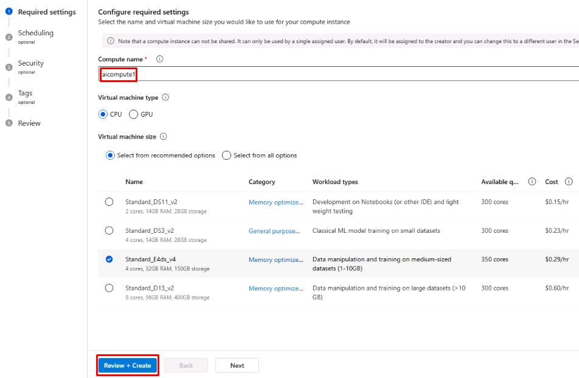

## Task 01: Manage compute at the hub level 

## Introduction

(case study information pertinent to this task)

## Description

In this task, you'll …

## Success Criteria

(what should be accomplished when the task is finished)

## Key Tasks

### 01: Create aicomput1 compute resource in hub

  
<strong>Expand this section to view the solution</strong>

1. From the **Azure AI Foundry Management center**, select **Compute** under the **Hub** section from the left menu.

    

1. From the **Manage compute resources in this hub** page, select **+ New**.

    {: .important }
    > A compute instance is a virtual machine that is used to run prompt flows within projects. It’s created at the hub level and accessible by any projects with proper permissions.

1. Name the compute instance **aicompute1**, leave the other settings as default,  then select **Review + Create**.

    

1. Once the compute instance is created, it should show a status of **Running**. 

    {: .important }
    > The compute instance will be used later to run prompt flows.

You’ve successfully completed this task.
