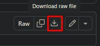
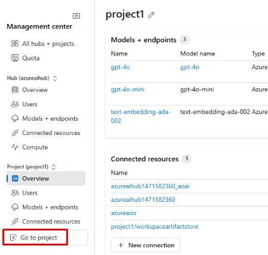
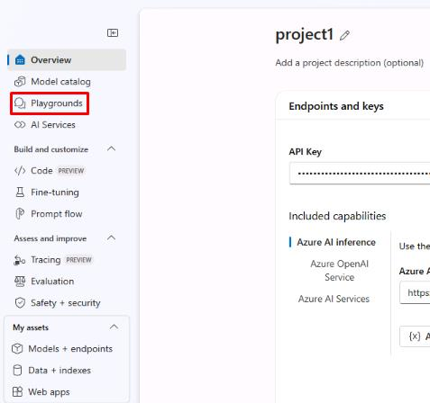
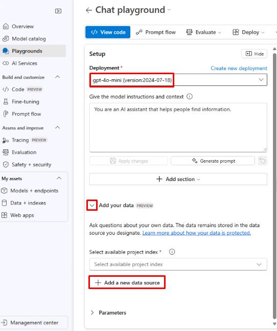
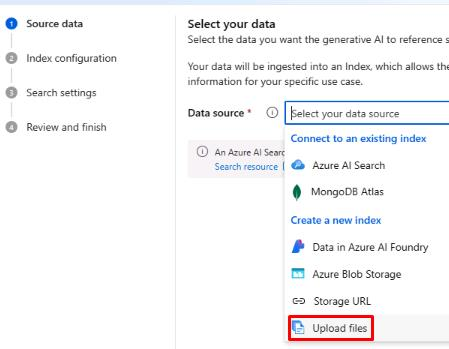
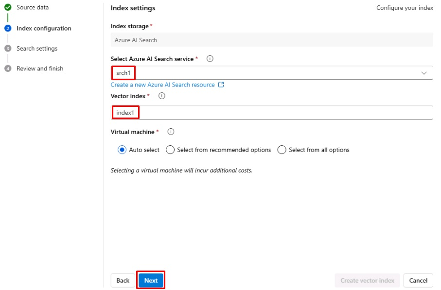
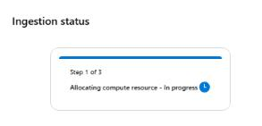

# Task 02: Add data and create a search index 

## Introduction

To enable personalized AI interactions, Adatum needs to integrate structured data that enhances chatbot responses. By indexing this data, the AI model can retrieve and process relevant customer and product information efficiently.

## Description

In this task, you'll add data to your project and index it for retrieval. This allows the chatbot to access relevant product details and improve customer interaction quality.

## Success Criteria

- **products.xlsx** has been created.
- **products.xlsx** has been indexed successfully.

## Learning Resources

- [Add your data and try the chat model again](https://learn.microsoft.com/en-us/azure/ai-studio/tutorials/deploy-chat-web-app)

## Key tasks

### 01. Download products.xlsx file for use in Playground

  

  
<strong>Expand this section to view the solution</strong>

1. Download the **products.xlsx** file [HERE](https://github.com/microsoft/TechExcel-Transform-Data-and-AI-solutions-with-Azure-AI-Platform/blob/main/src/products.xlsx)

    

### 02. Create vector index for gpt-4o-mini model

<strong>Expand this section to view the solution</strong>

1. Return to your browser tab with Azure AI Foundry. From the **Management center** for **project1**, select **Go to project** at the bottom of the left menu.

    

1. From the left menu of the **project1** page, select **Playgrounds**.

    

1. At the top of the page, select **Try the Chat playground**.

1. From the **Chat playground** page, ensure the **Deployment** is set to the **gpt-4o-mini** model, then select **+ Add a new data source** under the **Add your data** dropdown menu.

    

1. From the **Source data** tab on the **Add your data** page, select the **Data source** dropdown menu, then select **Upload files**.

    

1. Select the **Upload** dropdown menu, then select **Upload files**.

1. Select the **products.xlsx** file,then select **Open**. Select **Next** once it has been uploaded.

1. From the **Index configuration** tab, select the **Select Azure AI Search service** dropdown menu ,then select **srch1**.

1. Enter **index1** for the **Vector index** name, then select **Next**.

    

1. From the **Search settings** tab, leave the default settings, then select **Next**.

1. From the **Review and finish** tab, select **Create vector index**. 

    {: .note }
    > Wait for the index to be created. This should take about 3-5 minutes. The **Ingestion status** will show you the progress.
    
    

You’ve successfully completed this task. 
