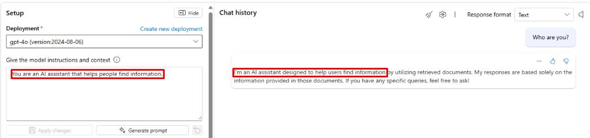
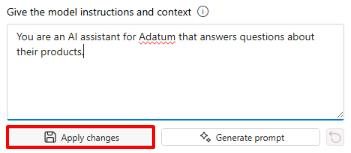
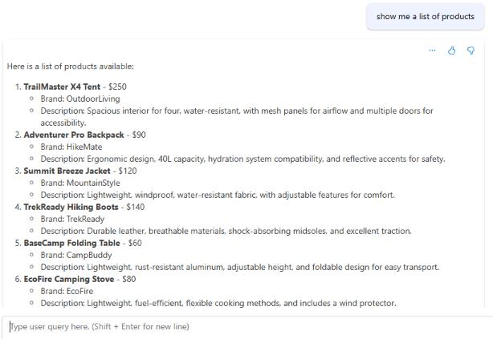
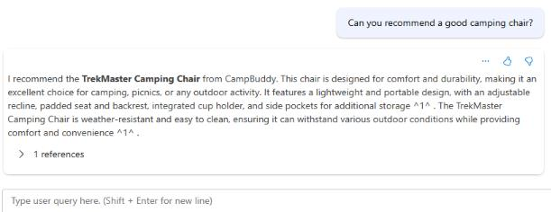

## Task 3 - Use Playground to chat with your data

1. Once the data has been indexed, select the chat box on the right of the playground and enter the following query:

    ```
    Who are you?
    ```

1. Select **Enter** and take note of the response. This is referencing the information provided in the system message, shown to the left.

    

1. Change the system message to the following, then select **Apply changes**:

    ```
    You are an AI assistant for Adatum that answers questions about their products.
    ```

    

1. Run the **Who are you?** query again and note the updated response.

    {: .important }
    > The system message can provide more than just context for the purpose of the tool, it can also be used to influence how the model behaves and responds to queries.

1. Next, run the following query:

    ```
    Show me a list of products.
    ```

    The response should return a list of products pulled from the **products.xlsx** file.

    

1. Next, run the following query to narrow down the products to what we're looking for:

    ```
    Can you recommend a good camping chair?
    ```

    The response should reference the **TrekMaster Camping Chair** and provide information about it. 

    

1. Run the following query to check the price of the chair:

    ```
    How much does it cost?
    ```

    The response should show the price of the **TrekMaster Camping Chair** as **$50**. 

    {: .important }
    > The chat history keeps track of the entire conversation with the chatbot. In the previous question, we didn't specify what item we wanted the price for, but the chat was able to use context from chat history to properly answer the query.

1. You’ve successfully completed this task and exercise. Select **Next** to continue.
