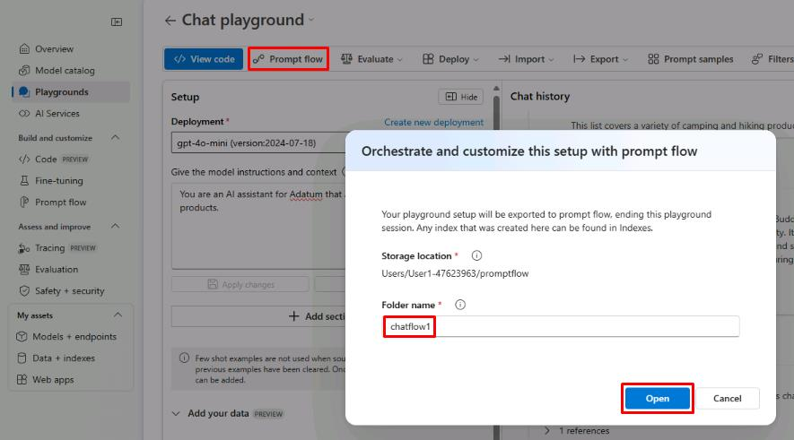
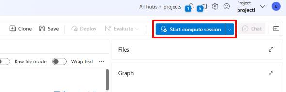

# Task 01: Create a chat flow with chat history

## Introduction

To enhance customer support and engagement, Adatum is implementing chat history tracking within its AI chatbot. Maintaining chat history allows for more context-aware interactions, improving user experience and reducing repetitive queries.

## Description

In this task, you'll create a chat flow using your existing playground configuration as a template. This structured approach ensures consistency in chatbot interactions and enables tracking of previous conversations for better response accuracy.

## Success Criteria

- The chat flow has been created successfully.

## Learning Resources

- [Prompt flow in Azure AI Foundry portal](https://learn.microsoft.com/en-us/azure/ai-studio/how-to/prompt-flow)

## Key tasks

### 01: Create prompt flow using Playground as a template

<strong>Expand this section to view the solution</strong>

1. From the **Chat playground** page, select **Prompt flow** at the top.

1. On the **Orchestrate and customize this setup with prompt flow** pop-up window, enter **chatflow1** for the name and select **Open**.

    

    {: .important } 
    > This is using the current playground configuration as a template to create a chat flow with chat history. This flow can be created manually from the **Prompt flow** section, but deploying it from the playground will be quicker and require less configuration in this case.

1. From the **chatflow1** page, select **Start compute session** in the upper right of the window . This will start the compute session created earlier.

    

    {: .important }
    > The prompt flow page contains two main panes. On the left is the flow  pane, which allows you to add and configure new flows with LLMs, prompts, and various Python tools. The right pane contains a graph, allowing you to easily visualize the flow of different nodes. The graph will update dynamically as updates are made in the flow pane. 

You’ve successfully completed this task. 
