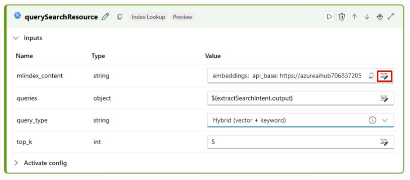
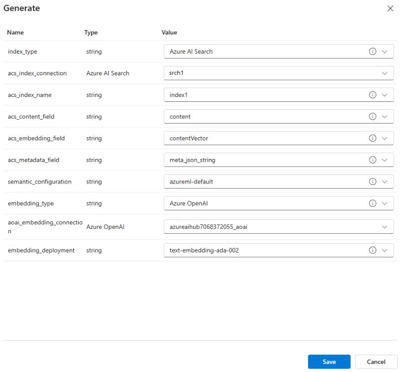

# Task 01: Create a chat flow with chat history

## Introduction

To enhance customer support and engagement, Adatum is implementing chat history tracking within its AI chatbot. Maintaining chat history allows for more context-aware interactions, improving user experience and reducing repetitive queries.

## Description

In this task, you'll create a chat flow using your existing playground configuration as a template. This structured approach ensures consistency in chatbot interactions and enables tracking of previous conversations for better response accuracy.

## Success Criteria

- The chat flow has been created successfully.

## Learning Resources

- [Prompt flow in Azure AI Foundry portal](https://learn.microsoft.com/en-us/azure/ai-studio/how-to/prompt-flow)

## Key tasks

### 01: Create prompt flow using Playground as a template

<strong>Expand this section to view the solution</strong>

{: .warning }
> Before continuing, ensure that the **project1/workspaceblobstore** connection has the **Storage Blob Data Contributor** and **Storage File Data Privileged Contributor** roles.

1. Return to the tab with Azure portal.

1. In the search bar at the top, enter **storage** and then select **Storage accounts**.

1. Select the storage account, then select **Security + networking** > **Networking** from the left menu.

1. For **Public network access**, select **Enabled from all networks**, then select **Save**.

    

1. Select **Settings** > **Configuration** from the left menu.

1. For **allow storage account key access**, select **Enabled**, then select **Save**.

    

1. Return to the tab with **Chat playground** and select **Prompt flow** from the left menu.

1. Select **+ Create**, then select **Upload** under **Upload from local**.

1. Download the **chatflow.zip** file [HERE](../../src/chatflow.zip).

1. On the **Upload from local** pane, select **Zip file**, then select **Browse** and upload the **chatflow.zip** file.

1. Name the folder **chatflow1**, set the **Select flow type** field to **Chat flow**, and select **Upload**.

    

1. Once the chat flow is created, select **Start compute session** in the top right.

    

    {: .important }
    > The prompt flow page contains two main panes. On the left is the flow pane, which allows you to add and configure new flows with LLMs, prompts, and various Python tools. The right pane contains a graph, allowing you to easily visualize the flow of different nodes. The graph will update dynamically as updates are made in the flow pane. 

1. In the left pane, find the **rewriteIntent** node and connect it to your hub. Ensure the deployment is set to **gpt-4o-mini** and the response it set to **text**.

    

1. Next, find the **generateReply** node and configure the same settings.

    

    {: .note }
    > Ensure the compute instance has started before continuing.

1. Next, find the **querySearchResource** node and select the edit icon next to **mlindex_content**.

    

1. Set the **acs_index_connection** and set it to the **srch1** index. Ensure the remaining fields match the screenshot below and select **Save**.

    

1. Find the **contentsafety** node at the bottom and delete it for now. We'll add this in a later step.

    

You’ve successfully completed this task. 
