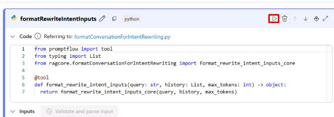
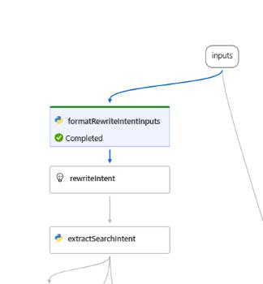
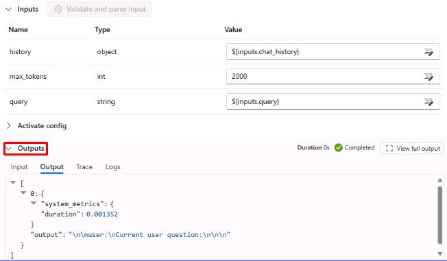
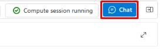
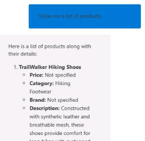

## Task 02: Test the chat flow

## Introduction

(case study information pertinent to this task)

## Description

In this task, you'll …

## Success Criteria

(what should be accomplished when the task is finished)

## Key tasks

### 01: Test the individual items using the flow pane

<details markdown="block">
<summary><strong>Expand this section to view the solution</strong></summary>

1. Once the compute session is running, scroll to the first item in the flow pane on the left, **formatRewriteIntentInputs** and select the play button in the upper right.

    

    {: .important }
    > This will allow you to test a single flow at a time. This is useful when building a new flow and connecting the individual elements. The graph to the right will also show the status of the test.

    

1. Once the test has completed, select the **Outputs** dropdown menu at the bottom of the **formatRewriteIntentInputs** flow.

    

    {: .important }
    > Once a test has been run on a flow, the **Outputs** dropdown menu will show under that item. You can use this to test the connection of your flow. As multiple items in a flow link together, ensuring the correct input and output values for each is important. 

1. To test the entire flow, select **Chat**  in the upper right. This will bring up a chat window over the flow visualization graph.

    

1. In the chat, run the following query to test the overall functionality of the flow:

    ```
    Show me a list of products.
    ```

    The response should show a list of products, like in the playground. 

    

1. Close the chat window with the **X** in the upper right to return to the flow visualization graph. Note that all flow items show as **Completed** as a result of running the entire flow.

    {: .important }
    > Each of the items in the flow pane will now have output data relevant to an actual test. You can check the outputs of the different flows to get a better idea of how information is being linked and passed between them.

</details?

You’ve successfully completed this task. Select **Next** to continue. 
