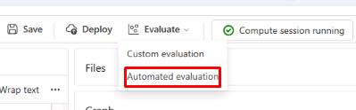
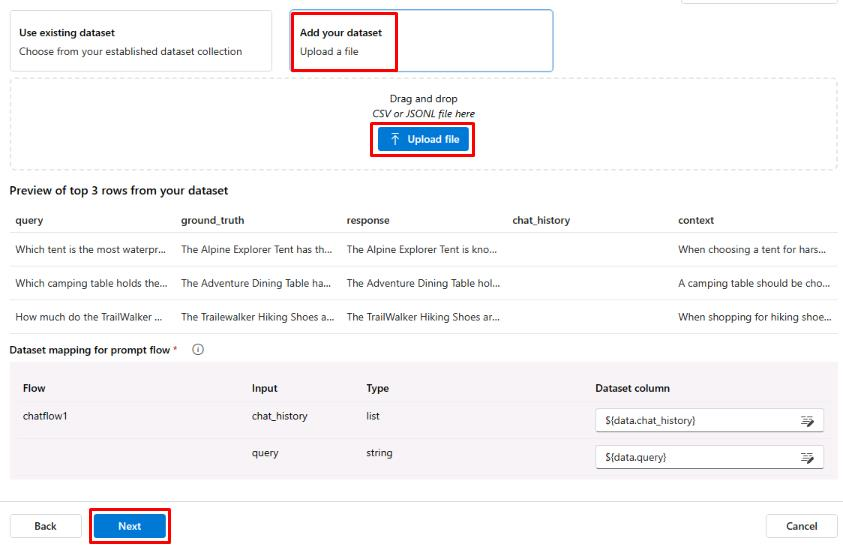
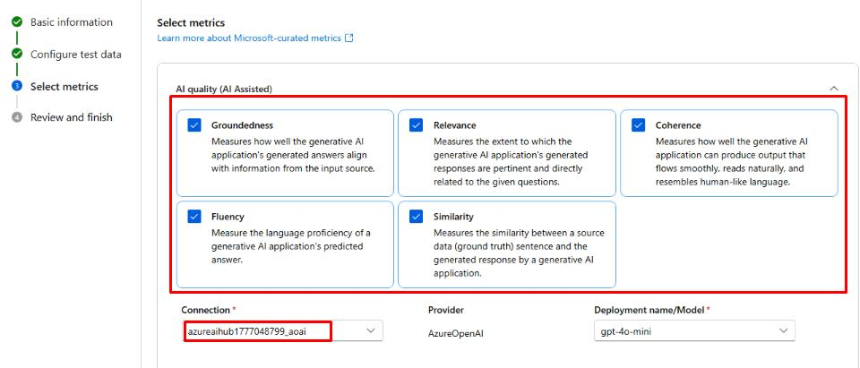
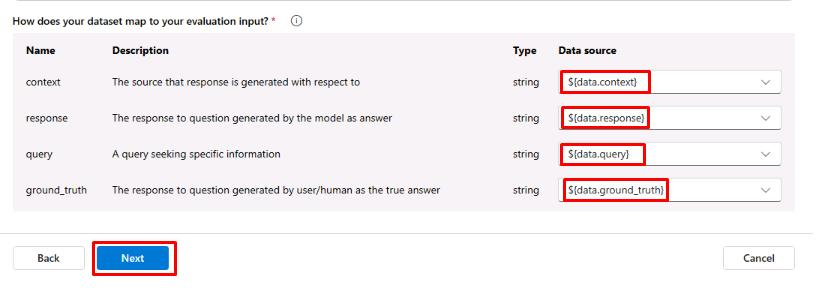
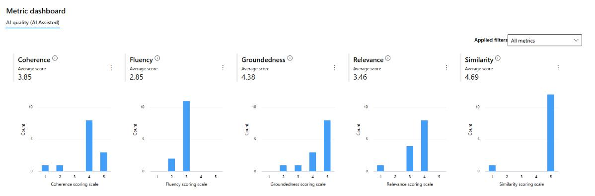

# Task 03: Evaluate the chat flow

## Introduction

Evaluating chatbot interactions ensures that responses align with Adatum’s customer service goals. Using predefined criteria, Adatum can measure and refine chatbot accuracy, relevance, and coherence.

## Description

In this task, you'll assess chatbot performance using key evaluation metrics. By setting up automatic evaluation for Groundedness, Relevance, Coherence, Fluency, and Similarity, Adatum can ensure that the chatbot maintains high-quality interactions and meets user expectations.

## Success Criteria

- The flow evaluation is completed successfully.

## Learning Resources

- [Manually evaluate prompts in Azure AI Foundry portal playground](https://learn.microsoft.com/en-us/azure/ai-studio/how-to/evaluate-prompts-playground)

## Key tasks

### 01: Set up the automatic evaluation for Groundedness, Relevance, Coherence, Fluency, and Similarity.

<strong>Expand this section to view the solution</strong>

1. Download the **eval.json** file <a href="../../src/eval.json">HERE</a>.

1. On the **chatflow1** page, select **Evaluate** and then select **Automated evaluation**.

    

1. On the **Basic information** tab, set the **Evaluation name** to **eval1** and select **Next**.

1. On the **Configure test data** tab, select **+ Add your dataset**.

1. Select **Upload file** and select the **eval.jsonl** file.

1. Once the data loads, ensure the **chat_history** value is set to **${data.chat_history}** and the **query** value is set to **${data.query}**, then select **Next**.

    

1. On the **Select metrics** tab, select the checkboxes for **Groundedness**, **Relevance**, **Coherence**, **Fluency**, and **Similarity**.

1. Select your connection from the **Connection** dropdown menu. The **gpt-4o-mini** model should be automatically selected.

    

1. Scroll to the bottom and ensure the data mapping is correct, then select **Next**:

    

1. Select **Submit** and wait for the evaluation to finish.

{: .important }
> Once the evaluation is finished, you'll see scores for the metrics that were selected. These scores are based on the chat flow's response to the test data. You can scroll down to see more detailed information on the metric scores and the reasoning behind those scores.
> 

You’ve successfully completed this task.
