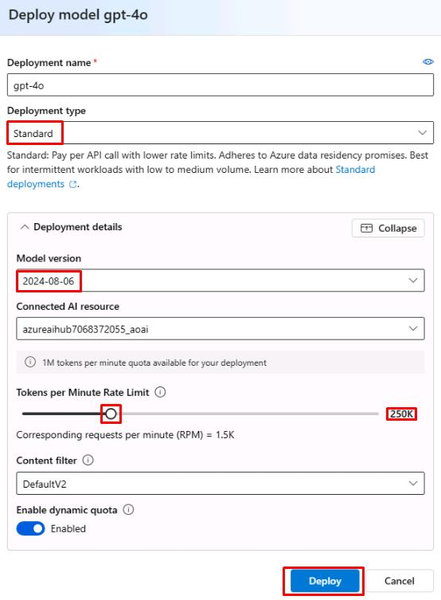

# Task 04: Introduction to Azure AI Agent Service


## Introduction

Azure is introducing the Azure AI Agent Service to help developers create secure, stateful AI agents that automate complex business processes. This service integrates models, tools, and data sources, making it easier for businesses to deploy autonomous agents for a range of tasks like scheduling, market research, customer service, and code management.

The service leverages a wide array of tools, including Azure Logic Apps, Azure Functions, OpenAPI 3.0, and more. It also provides secure data grounding via Bing, SharePoint, and Azure Blob, ensuring agents have accurate, up-to-date information. With multi-modal support and a flexible model selection, including OpenAI and other top-tier providers, developers can optimize their agents for specific tasks.

Azure AI Agent Service is built for enterprise use, offering features like secure data handling, compliance, and monitoring. It’s designed for scalability and reliability, with built-in performance tracking and content filters to ensure safe, high-quality outputs. Additionally, the service supports multi-agent orchestration for more complex workflows.

This platform is designed to simplify agent creation, allowing businesses to rapidly develop, deploy, and manage AI agents to improve efficiency and productivity.


## Description

In this task, you'll learn how to set up and deploy the Azure AI Agent Service. By following the steps, you will understand how to integrate various tools and data sources to create secure, stateful AI agents that can automate complex business processes.

## Success criteria

- The Azure AI Agent Service is set up and deployed successfully.
- The AI agents created are able to automate tasks like scheduling, market research, customer service, and code management.

## Key tasks

### 01: Set up the automatic evaluation for Groundedness, Relevance, Coherence, Fluency, and Similarity.

<details markdown="block">
<summary><strong>Expand this section to view the solution</strong></summary>

1. From the **project1** page, select **Models + endpoints** from the left menu.

1. Select **+ Deploy model**, then select **Deploy base model**.

1. Select the **gpt-4o** model, then select **Confirm**.

    

1. Set the **Deployment type** to **Standard**, set the **Tokens per Minute Rate Limit** to **250K**, then select **Deploy**.

    

1. Switch to the tab with Azure portal.

1. In the search bar at the top, search for +++bing+++ and then select **Bing Resources**.

    

1. From the **Bing Resources** page, select **+ Add**, then select **+ Grounding with Bing Search**.

1. On the **Create a Grounding with Bing Search resource** page, select your resource group and pricing tier. Give it a name of +++bingsrch+++ and select **Review + Create**, then select **Create**.

    

1. Return to the tab with the Azure AI model deployment and select **Agents** from the left menu.

1. Under **Select an Azure OpenAI Service resource**, select your hub and select **Let's go**.

    

1. Under **Select or deploy a model**, select **gpt-4o** then select **Next**.

    

    {: .important }
    > This will create a new agent using the specified model. 

1. Select the agent to open the **Setup** pane.

1. In the **Instructions** field of the **Setup** pane, enter the following:

    ```
    Understand User Query:
    Analyze the user's query to identify if it requires real-time information (e.g., weather, date, news).
    
    Use Bing Search Tool for Real-Time Data:
    If the query involves up-to-date information, use the Bing Search tool to retrieve relevant data.
    
    Craft a Clear, Concise Response:
    Extract the relevant information (e.g., temperature, news) and provide the answer in a simple and direct way.
    
    Ask for Clarification if Needed:
    If the query is vague or missing details (e.g., location for weather), ask the user for more information.
    ```

1. Under **Knowledge** in the **Setup** pane, select **+ Add**, then select **Grounding with Bing Search**.

1. Select the **+ Create connectioh** connection, then select **Add connection** next to the **bingsrch** resource.

    

    {: .important }
    > The **Knowledge** section allows you to specify the source of information for the agent. In this case, we’re using the **Grounding with Bing Search** service to retrieve up-to-date information from external sources, beyond our local dataset. You can also set the source to a pre-existing search index or local data. If you want the agent to be able to retrieve both local and web-based results, you can add a connection for each.

1. Under **Actions** in the **Setup** pane, select **+ Add**, then select **Code interpreter**.

1. On the **Add code interpreter action** page, select **Select local files** and then select the **products.xlsx** file created earlier.

1. Select **Upload and Save**.

    

    {: .important }The **Actions** section allows you to specify additional tasks for the agent beyond simple data retrieval. The **Code interpreter** tool can be used for tasks like performing calculations or creating visualizations from your data.

1. From the upper right of the **Setup** pane, select **Try in playground**.

1. In the **Agents playground** chat, enter +++What is the weather like in New York?+++

    

    {: .important }
    > The gpt-4o model doesn’t have direct access to the current date. However, by using the Bing Search tool, the agent can retrieve up-to-date information for time-sensitive queries.

1. In the chat, enter +++What is the average price of the products in the xlsx file?+++

    

    {: .important }
    > The code interpreter tool allows for more complex queries about your data. In this case, we used it to retrieve the average price of the products in our data set.

</details>

You’ve successfully completed this task and exercise.