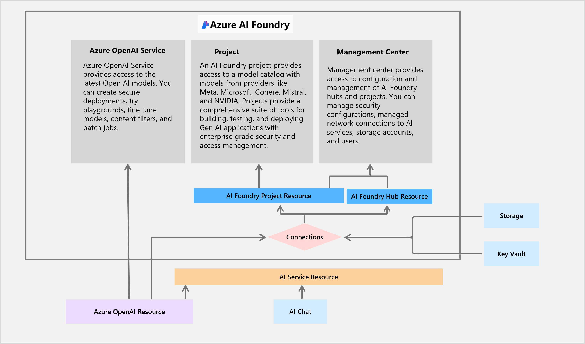

# Exercise 03: Set up Azure prompt flow

## Scenario

Adatum aims to leverage AI-driven solutions to reduce customer service response times and proactively address common issues through real-time analysis. By adhering to established best practices in prompt flow and content safety, Adatum is well-positioned to achieve these objectives. 

## Objectives

After you complete this exercise, you'll be able to:

 - Create and manage AI-driven chat flows.
 - Test and refine chat interactions for accuracy and efficiency.
 - Evaluate chatbot responses based on predefined criteria.

## Exercise three architecture

## Duration

**Estimated time:** 20 minutes
