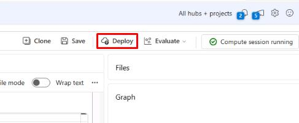
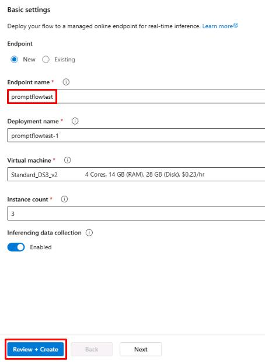
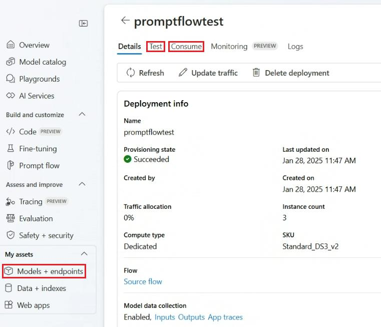
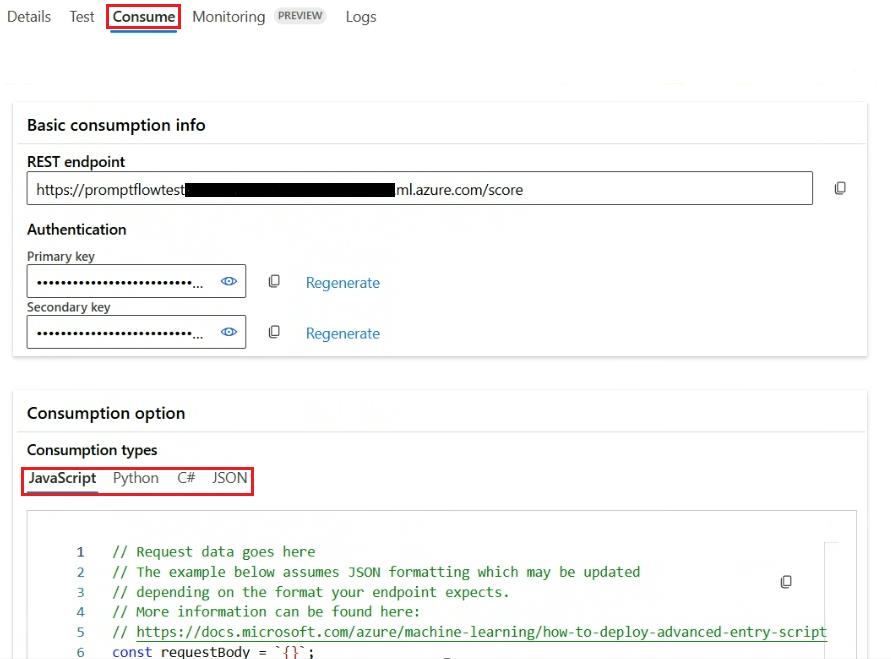

# Task 01: Deploy the chatbot

## Introduction

(case study information pertinent to this task)

## Description

In this task, you'll …

## Success Criteria

(what should be accomplished when the task is finished)

## Key tasks

### 01: Deploy the chat flow test

<details markdown="block">
<summary><strong>Expand this section to view the solution</strong></summary>

1. From the **chatflow1** page, select **Deploy** from the top.

    

1. On the **Basic settings** tab, set the **Endpoint name** to **promptflowtest** and leave all other settings as default.

1. Select **Review + Create**, then select **Create**.

    

</details>

### 02: Test the deployed chatflow

<details markdown="block">
<summary><strong>Expand this section to view the solution</strong></summary>
    
1. Once the deployment has finished, select **Models + endpoints** from the left menu and select **promptflowtest** from the list.

    {: .important }
    > From here, you can access the **Test** tab to test the chat application from the front end.

    

1. Use the **Test** tab to use the chat and run the same query as before:

    ```
    Show me a list of products.
    ```

    - The response  here should be similar to the response when it was run in the chat flow.

1. Select the **Consume** tab at the top of the **promptflowtest** page.

    {: .important }
    > The **Consume** tab has information for consuming the endpoint. You can see the endpoint URL, authentication keys, and consumption options for JavaScript, Python, C#, and JSON.

    

</details>

You’ve successfully completed this task and exercise.
