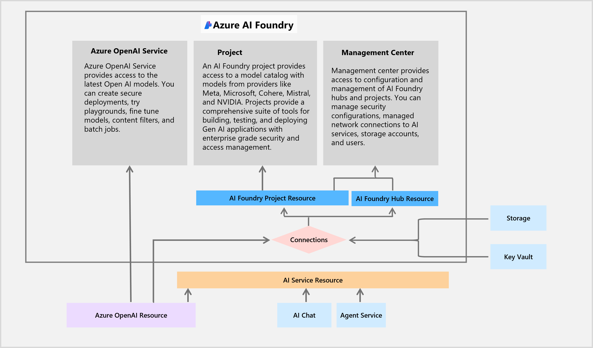

# Exercise 04: Deploy chatbot to a web app

## Scenario

Adatum is ready to deploy the new AI chatbot, offering a cohesive and personalized customer service experience.

## Objectives

After you complete this exercise, you'll be able to:

 - Deploy an AI chatbot to a web application.
 - Validate and test chatbot interactions in a live environment.

## Exercise four architecture

## Duration

**Estimated time:** 10 minutes
