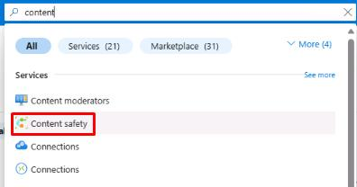

# Task 01: Setup Azure AI Content Safety

## Introduction

To ensure the chatbot operates within safe and ethical guidelines, Adatum needs to set up Azure AI Content Safety. This enables automatic monitoring and filtering of harmful or inappropriate content.

## Description

In this task, you'll set up Azure AI Content Safety and integrate it with your chatbot to monitor and filter content dynamically.

## Success Criteria

 - The Content Safety resource has been created.
 - The chatbot is successfully connected to the Content Safety resource.

## Learning Resources

- [Content safety tool for flows in Azure AI Foundry portal](https://learn.microsoft.com/en-us/azure/ai-studio/how-to/prompt-flow-tools/content-safety-tool#outputs)
 
## Key tasks

### 01: Create Content safety resource

<strong>Expand this section to view the solution</strong>

1. To connect the content safety tool to the prompt flow, you’ll need to first create a **Content safety** resource. Return to the tab with the Azure portal, and select the search box at the top. Enter **content**, then select **Content safety**.

    

1. Select **Create Content Safety**.

1. On the **Create Content Safety** page, select your resource group and region (these may differ from the screenshot), name the resource **csfilter-1**, and set the **Pricing tier** to **Free F0**.

1. Select **Review + Create**, then select **Create**.

    

### 02: Connect to Content safety resource

<strong>Expand this section to view the solution</strong>

    
1. Once the resource is created, return to the tab with **project1** and open the **Management center**.

1. On the **Overview** tab for **project1**, select **+ New connection** at the bottom of the window.

    

1. On the **Add a connection to external assets** page, select **Azure AI Content Safety**, then select **Add connection** next to the **csfilter-1** resource that was just created.

    

1. Close the connection window and return to the project by selecting **Go to project** at the bottom of the left menu. 

1. Return to **chatflow1** by selecting **Prompt flow** from the left menu.

1. Select **+ More tools** at the top, then select **Content Safety (Text Analyze)**.

    

1. This will add a node to the bottom of the flow and jump to it. Enter **contentsafety** for the node name, then select **Add**.

    {: .important }
    > The content safety tool enables moderation of user queries by filtering text that contains violence, self-harm, hate speech, or sexual content. Once activated, the tool allows for customized filtering levels for each category, prompting the user and logging relevant data when a filter condition is triggered. 
    > 
    > It’s important to note that the filter doesn’t block queries entirely but flags them based on the set criteria. While the content safety tool is particularly useful for open-source models or those lacking built-in moderation, the GPT-4o-mini model used here already includes integrated content moderation that automatically blocks harmful queries.

1. Once the node has been added, you'll see multiple settings for it. Use the dropdown menus to set the **connection** to **csfilter1**, set the **text** to **${inputs.query}**, and set the **violence_category** to **low_sensitivity**.

    

You’ve successfully completed this task.
