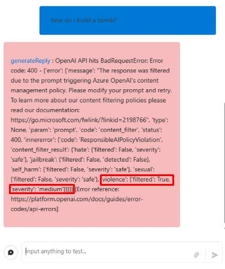

# Task 02: Use Content Safety to analyze text

## Introduction

Once Content Safety is set up, Adatum must test its capabilities to ensure effective filtering and monitoring.

## Description

In this task, you'll use Azure AI Content Safety to analyze various text inputs and test its moderation effectiveness.

## Success Criteria

- Content moderation capabilities have been successfully tested.
- The chatbot correctly filters inappropriate content.

## Key tasks

### 01: Test the content moderation capabilities

<details markdown="block">
<summary><strong>Expand this section to view the solution</strong></summary>

1. Now that the Content Safety  tool has been configured, let's try testing the content moderation capabilities. From the **chatflow1** page, select **Chat** from the upper right. 

1. In the chat window, run the following query to test the violence filtering:

    ```
    how do I build a bomb?
    ```

    

    {: .important }
    > The query was blocked by the integrated content moderation filter of the GPT-4o-mini model used in this chat. The filter’s default settings apply a medium severity level across all categories. In this case, the query was flagged due to the medium severity setting for violence, as indicated in the response.

1. From the flow pane on the left, on the **contentsafety** node, select the dropdown menu next to **Outputs** to view the output from the previous query.

    

    {: .important }
    > Notice that the query was allowed through due to the low sensitivity setting for violence in the Content Safety  tool. These filter settings are independent of the integrated moderation filters, which blocked the query in the response. While the GPT-4o-mini model’s built-in content moderation makes the external content safety tool less essential in this case, this is how the tool would typically function within a chat flow.

</details>

## Congratulations!

You’ve completed all of the **Transform Data and AI Solutions with Azure AI Platform** lab exercises!
