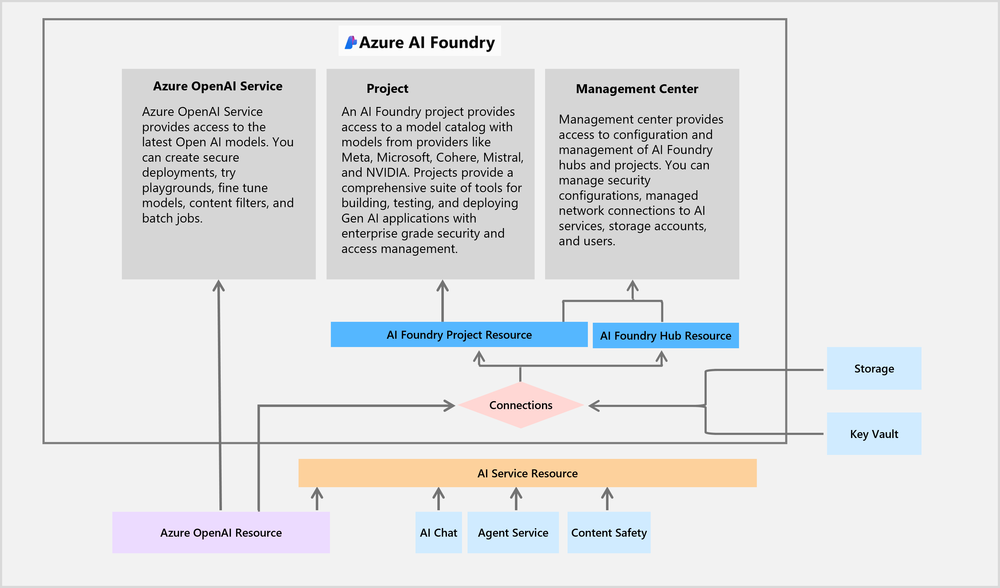

# Exercise 05: Content moderation

## Scenario

With the chatbot now deployed, Adatum is prepared to evaluate its threat detection, safety and monitoring capabilities.

## Objectives

After you complete this exercise, you'll be able to:

 - Implement AI-driven content moderation.
 - Use Azure AI Content Safety to analyze and filter text for compliance and security.

## Exercise five architecture

## Duration

**Estimated time:** 15 minutes
