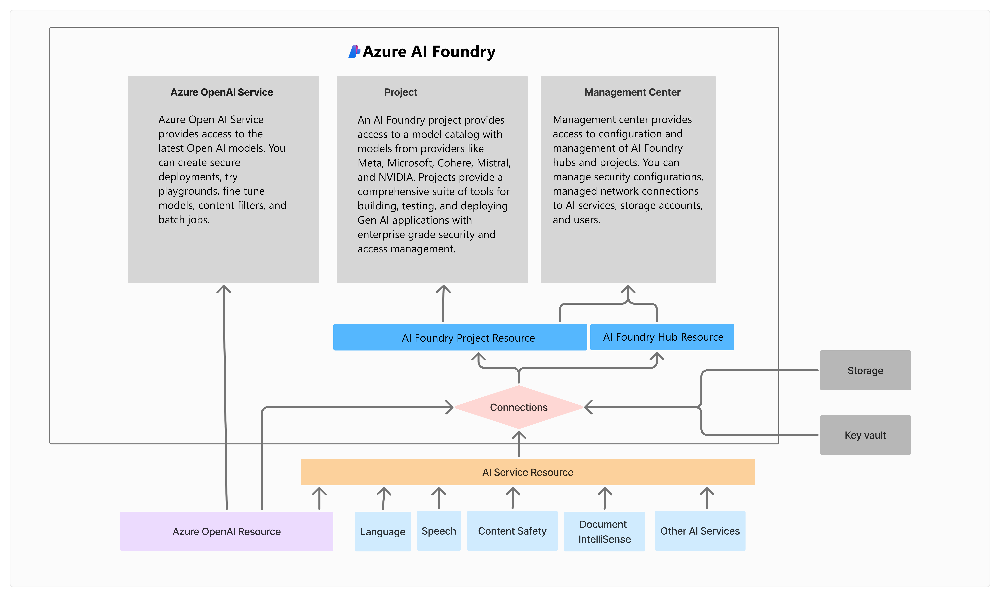

# TechExcel: Transform Data and AI solutions with Azure AI Platform 

## Customer scenario

Adatum Corporation, based in Atlanta, GA, operates 1,500 stores nationwide and aims to use cutting-edge technology to enhance customer interactions and streamline operations. Many of their systems still rely on their on-premises data center.

CIO Ana Bowman   is exploring the potential of Generative AI  to improve customer engagement and operational efficiency, saying, "AI will significantly boost our customer service and operations."

Adatum plans to enhance user experience by moderating customer reviews and feedback on their mobile app and website and offering personalized shopping via an AI-powered chatbot. They aim for a 10% reduction in customer service response times by the end of Q4 next fiscal year.

Their retail website handles high traffic and needs to support thousands of concurrent users and API calls efficiently. Application Architect Kiana   Anderson notes that scaling during peak seasons has caused issues, including outages. A more effective scaling strategy is essential to optimize user experience.

Adatum also recognizes the need for AI-driven solutions to address rising customer expectations for fast and accurate support, especially during peak periods. By automating routine inquiries and analyzing interactions in real-time, they aim to improve response times and proactively refine their services.

Lastly, Adatum seeks to integrate customer data and feedback to create a personalized experience and drive innovation. Modernizing their data management and analytics will help them stay competitive and sustain growth.

## Current architecture

## Trying to accomplish

By the end of this workshop, you’ll be able to: 

- Moderate user content in Azure AI Foundry.
- Create a customized chat flow.
- Integrate a personalized website chatbot.
- Evaluate flow and metrics review of data.

## Exercises

This lab has the following exercises:
- Set up Azure AI Foundry
- Perform prompt engineering
- Set up Azure prompt flow
- Deploy chatbot to a web app
- Content moderation

